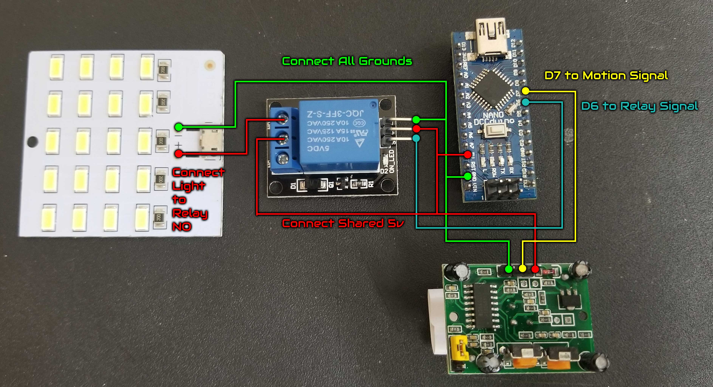
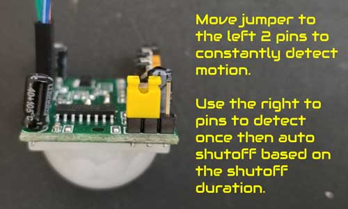
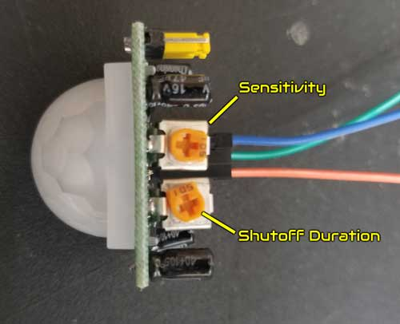

# enclosure-light

Arduino Nano powered automatic LED lamp with proximity detection. Used in the enclosure that houses [droxeybot](https://droxey.com/droxeybot).

## Credits & Resources

Hardware and original sketch distributed in the [Alien3D June 2020 UFO Subscription Box](https://www.alien3d.us/june-2020-ufo-contents/).
